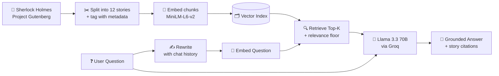

# 🕵️ Sherlock Holmes RAG Chatbot

<p align="center">
  <a href="https://sherlock-rag-chatbot-pu2gbc9xtveh2wmgnrau2b.streamlit.app"></a>
</p>

> A pilot-hardened conversational chatbot that answers questions about *The Adventures of Sherlock Holmes* — grounded in the actual text of the book, with source citations you can verify.

<p align="center">
  
  
  
  
  
</p>

---

## 🎯 What it does

Ask the bot anything about the twelve stories in Conan Doyle's *Adventures of Sherlock Holmes* — plots, characters, motives, quotes, red herrings — and it answers using only passages retrieved from the actual book, citing which story the answer came from.

Example questions:
- *"Who is Irene Adler and why does Holmes remember her?"*
- *"What was the trick behind The Red-Headed League?"*
- *"How did Holmes solve the Speckled Band mystery?"*

Follow-up questions work naturally — the bot has conversational memory and stays locked to the story you were discussing.

---

## 🧠 How it works (RAG in three steps)



1. **Index time** — The book is split into its 12 individual stories, each tagged with metadata. Chunks are embedded into 384-dim vectors and stored on disk.
2. **Query time** — Vague follow-ups are rewritten into standalone queries using conversation history. The rewritten query is embedded, top-k chunks retrieved via cosine similarity, and low-relevance retrievals are rejected outright.
3. **Answer time** — The LLM receives the question + retrieved chunks + conversation history + a strict grounding prompt, and writes an answer citing which story each chunk came from.

---

## 🛠️ Tech Stack

| Component | Purpose | Why this choice |
|---|---|---|
| **Groq — Llama 3.3 70B** | LLM inference | Free tier, ~500 tokens/sec — fastest inference available |
| **LlamaIndex** | RAG orchestration | Purpose-built for RAG, minimal boilerplate |
| **`CondensePlusContextChatEngine`** | Query rewriting | Fixes conversational drift on vague follow-ups |
| **HuggingFace `all-MiniLM-L6-v2`** | Text embeddings | Runs locally, 90 MB, strong on English prose |
| **Streamlit** | Web UI | One-file Python → shareable web app |
| **Project Gutenberg** | Source text | Public domain — safely redistributable |

---

## ✨ Features

- 💬 **Conversational memory** — follow-ups work naturally, locked to the story being discussed
- ✍️ **Query rewriting** — vague messages like *"tell me more"* are expanded into full queries before retrieval
- 🎯 **Relevance floor** — bot refuses to answer when retrieval quality is too low, instead of guessing
- 📖 **Story-tagged citations** — every source shows which of the 12 stories it came from, with relevance scores
- 🧭 **Smart disambiguation** — ambiguous questions get clarification requests rather than random answers
- ⚙️ **Live tuning** — adjust top-k and temperature from the sidebar
- 💡 **Suggested questions** — quick-start buttons so demos never begin with a blank chat
- 🔒 **Grounded answers** — strict system prompt prevents the LLM from using outside knowledge

---

## 🚀 Run it locally

**1. Clone**

```bash
git clone https://github.com/abssiabdulrahman/sherlock-rag-chatbot.git
cd sherlock-rag-chatbot
```

**2. Install dependencies**

```bash
pip install -r requirements.txt
```

**3. Add your Groq API key**

Create a `.streamlit/secrets.toml` file:

```toml
GROQ_API_KEY = "your_groq_key_here"
```

Get a free key at [console.groq.com](https://console.groq.com/keys).

**4. Run**

```bash
streamlit run streamlit_app.py
```

Open [http://localhost:8501](http://localhost:8501).

---

## 📓 Notebook

The full RAG pipeline is documented step-by-step in [`sherlock_rag_chatbot.ipynb`](./sherlock_rag_chatbot.ipynb) — read this if you want to understand every design decision (chunk size, overlap, top-k, prompt engineering, memory limits, ambiguity handling).

---

## 📂 Project structure

```
sherlock-rag-chatbot/
├── streamlit_app.py            # The Streamlit UI (v2.1)
├── sherlock_rag_chatbot.ipynb  # Annotated walkthrough of the RAG build
├── requirements.txt            # Python dependencies
├── data/
│   ├── sherlock_holmes.txt     # Raw Gutenberg text
│   └── stories/                # Per-story text files (12 stories)
└── vector_index_v2/            # Pre-built LlamaIndex store with story metadata
```

---

## 🎓 What I learned

- **RAG grounding is a prompt problem.** A strict, numbered system prompt (*"answer using ONLY the provided context"*) is the difference between a bot that cites the book and one that hallucinates plausibly.
- **Retrieval is often the bottleneck**, not generation. Vague follow-ups like *"tell me more"* embed poorly and return random chunks. Query rewriting via `CondensePlusContextChatEngine` was the single biggest quality upgrade.
- **Chunk size matters.** 512 tokens with 64-token overlap keeps semantic units together without stuffing the context window.
- **Metadata unlocks better UX.** Tagging chunks with story titles turns anonymous citations into meaningful ones — *"from A Scandal in Bohemia"* instead of *"chunk #47"*.
- **Local embeddings save cost.** MiniLM runs on CPU with zero API calls, keeping the whole system on Groq's free tier.
- **Session state ≠ shared state.** Streamlit's `session_state` gives each user their own conversation memory without any user-management code.
- **Handle failure loudly.** Wrapping the LLM call in try/except and adding a relevance floor turns unpredictable failures into clear, actionable messages.

---

## 📚 Data

*The Adventures of Sherlock Holmes* by Sir Arthur Conan Doyle — [Project Gutenberg #1661](https://www.gutenberg.org/ebooks/1661). Public domain.

---

<p align="center">
  Built by <a href="https://github.com/abssiabdulrahman">Abdul Rahman Abssi</a> · Berlin
</p>
