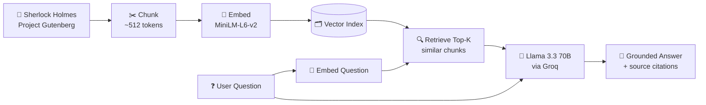

# 🕵️ Sherlock Holmes RAG Chatbot
<p align="center">
  <a href="YOUR_STREAMLIT_URL"></a>
</p>

> A conversational chatbot that answers questions about *The Adventures of Sherlock Holmes* — grounded in the actual text of the book, not the LLM's memory.

<p align="center">
  
  
  
  
  
  
  
</p>

---

## 🎯 What it does

Ask the bot anything about the twelve stories in Conan Doyle's *Adventures of Sherlock Holmes* — plots, characters, motives, quotes, red herrings — and it answers using only passages retrieved from the actual book, with sources you can inspect.

Example questions:
- *"Who is Irene Adler and why does Holmes remember her?"*
- *"What was the trick behind The Red-Headed League?"*
- *"How did Holmes solve the Speckled Band mystery?"*

Follow-up questions work too — the bot has conversational memory.

---

## 🧠 How it works (RAG in three steps)



1. **Index time (once)** — The book is split into overlapping chunks. Each chunk is embedded into a 384-dimensional vector and stored on disk.
2. **Query time** — The user's question is embedded, the top-k most similar chunks are retrieved via cosine similarity.
3. **Answer time** — The LLM receives the question + retrieved chunks + conversation history and writes an answer grounded in the retrieved text.

---

## 🛠️ Tech Stack

| Component | Purpose | Why this choice |
|---|---|---|
| **Groq — Llama 3.3 70B** | LLM inference | Free tier, fastest inference available |
| **LlamaIndex** | RAG orchestration | Purpose-built for RAG, minimal boilerplate |
| **HuggingFace `all-MiniLM-L6-v2`** | Text embeddings | Runs locally, small (~90 MB), strong on English prose |
| **Streamlit** | Web UI | One-file Python → shareable web app |
| **Project Gutenberg** | Source text | Public domain — safely redistributable |

---

## ✨ Features

- 💬 **Conversational memory** — follow-up questions work naturally
- 📖 **Source citations** — every answer shows the retrieved chunks with relevance scores
- ⚙️ **Live tuning** — adjust top-k and temperature from the sidebar
- 🔒 **Grounded answers** — the bot refuses to guess when the book has no answer
- 🐳 **Docker-ready** — optional Dockerfile for self-hosted deployment

---

## 🚀 Run it locally

**1. Clone**

```bash
git clone https://github.com/abssiabdulrahman/sherlock-rag-chatbot.git
cd sherlock-rag-chatbot
```

**2. Install dependencies**

```bash
pip install -r requirements.txt
```

**3. Add your Groq API key**

Create a `.streamlit/secrets.toml` file:

```toml
GROQ_API_KEY = "your_groq_key_here"
```

Get a free key at [console.groq.com](https://console.groq.com/keys).

**4. Run**

```bash
streamlit run streamlit_app.py
```

Open [http://localhost:8501](http://localhost:8501).

---

## 📓 Notebook

The full RAG pipeline is documented step-by-step in [`sherlock_rag_chatbot.ipynb`](./sherlock_rag_chatbot.ipynb) — read this if you want to understand every design decision (chunk size, overlap, top-k, prompt engineering, memory limits).

---

## 📂 Project structure

```
sherlock-rag-chatbot/
├── streamlit_app.py            # The Streamlit UI
├── sherlock_rag_chatbot.ipynb  # Annotated walkthrough of the RAG build
├── requirements.txt            # Python dependencies
├── Dockerfile                  # Optional self-hosted deployment
├── data/
│   └── sherlock_clean.txt      # Cleaned book text (Gutenberg boilerplate stripped)
└── vector_index/               # Pre-built LlamaIndex store
```

---

## 🎓 What I learned

- **RAG grounding** — a good system prompt (*"answer using ONLY the provided context"*) is the difference between a bot that cites the book and one that hallucinates plausibly.
- **Chunk size matters** — 512 tokens with 64-token overlap keeps semantic units together without stuffing the context window.
- **Local embeddings save cost** — MiniLM runs on CPU with zero API calls, keeping the whole system on Groq's free tier.
- **Session state ≠ shared state** — Streamlit's `session_state` gives each user their own conversation memory without any user-management code.

---

## 📚 Data

*The Adventures of Sherlock Holmes* by Sir Arthur Conan Doyle — [Project Gutenberg #1661](https://www.gutenberg.org/ebooks/1661). Public domain.

---

## 📄 License

MIT — see [LICENSE](./LICENSE).

---

<p align="center">
  Built by <a href="https://github.com/abssiabdulrahman">Abdul Rahman Abssi</a> · Berlin
</p>
